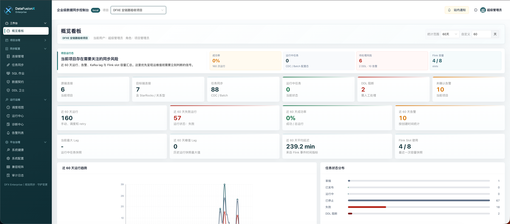
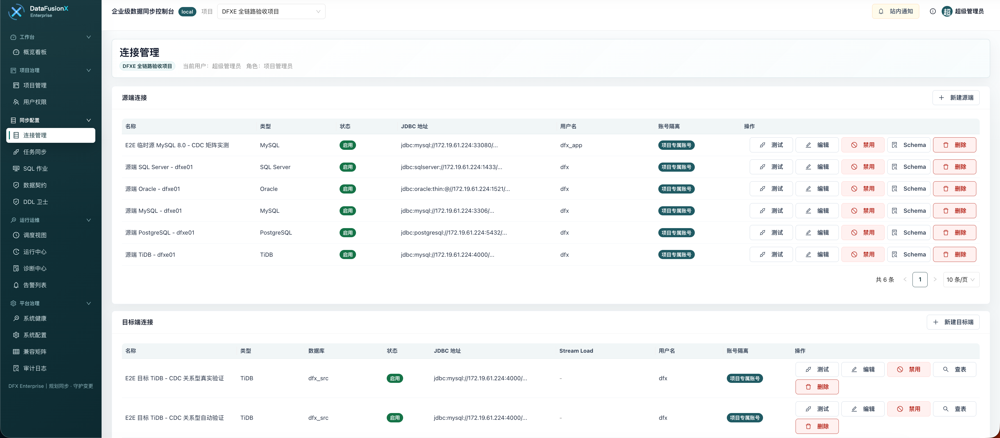
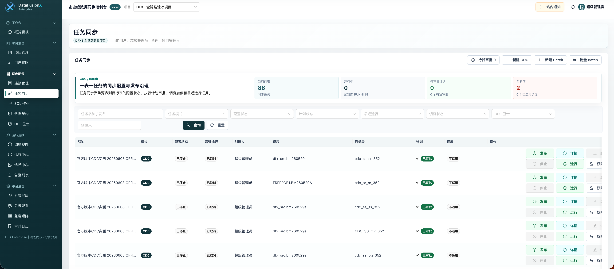
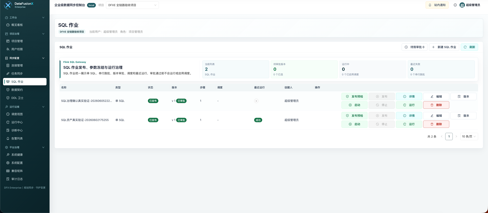
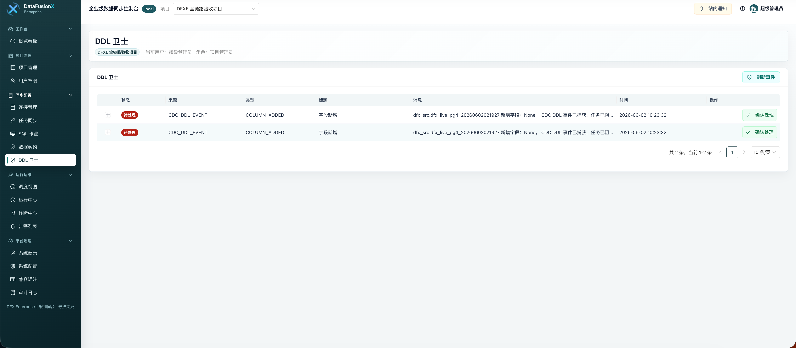
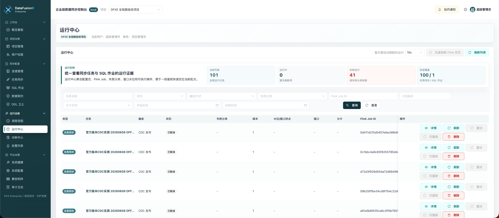
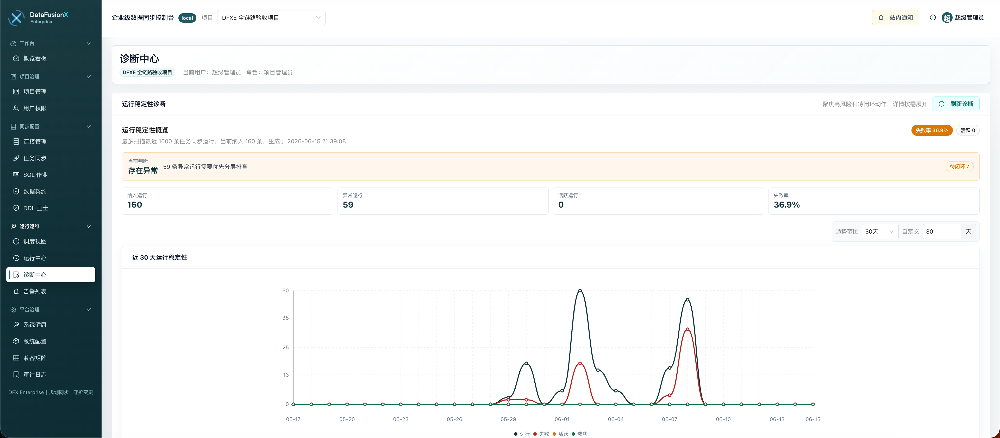
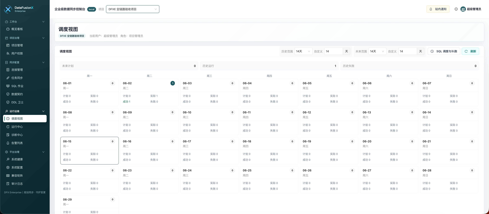

# DataFusionX Enterprise

DataFusionX Enterprise 是面向企业 IT、DBA、数据开发和运维团队的私有化数据同步控制台。本仓库是面向用户下载和部署使用的公开仓库，包含固定版本部署编排、Helm Chart、校验工具、运维脚本、产品文档和测试环境截图，不包含私有源码、客户 License、激活码或现场凭据。

当前发布版本：`0.1.0-deploy-smoke`

## 项目定位

DataFusionX Enterprise 聚焦企业数据同步“控制面”：把连接管理、CDC / Batch 任务配置、SQL 作业治理、执行计划审批、调度、运行观测、诊断、DDL 变更处理、审计和授权管理统一到一个可交付、可审计、可运维的平台中。

平台不托管生产数据面资源，不自动创建 Kafka Topic、Debezium Connector、TiCDC Changefeed、Flink 集群、生产目标表或数据库授权 SQL。源端、目标端、Kafka、Flink SQL Gateway 和目标表仍由企业现有数据平台、DBA 或运维团队按内部规范准备；DataFusionX Enterprise 负责读取配置、生成执行计划、提交外部 Flink SQL 作业并持续观测运行状态。

## 核心能力

- 项目治理：项目隔离、成员角色、资源级授权、配置导入导出和审计留痕。
- 连接管理：统一维护 MySQL、TiDB、PostgreSQL、Oracle、SQL Server、StarRocks 等源端和目标端连接，支持连通性检查和 catalog 校验。
- 任务同步：支持 CDC 与 Batch，同步任务保持一表一任务、一表一执行计划、一表一运行观测。
- SQL 作业：支持单 SQL 和多步骤串行跑批，提供参数冻结、输入输出资产声明、发布审批、调度和结果预览。
- 审批与调度：执行计划审批通过后才允许启动、部署或启用调度；支持 Once、指定时间、Cron 和补跑。
- 运行观测：运行中心统一展示 CDC、Batch 和 SQL 作业运行记录、Flink Job 状态、日志、指标、告警和一致性校验。
- DDL 卫士：对 CDC DDL 事件和 Batch catalog drift 做阻断、确认和审计，避免未确认结构变更进入生产链路。
- 诊断中心：聚合失败分类、稳定性趋势、容量风险和待闭环动作，辅助运维排障和投产复核。
- 平台治理：系统健康、系统配置、兼容矩阵、告警通知、商业授权和升级回滚工具链。

## 快速部署

```bash
git clone https://github.com/Lynn-Lee/DataFusionX-Deploy.git
cd DataFusionX-Deploy
cp .env.example .env
```

编辑 `.env`，至少替换所有 `change-me` 值，并设置数据库密码、JWT 密钥、加密密钥、管理员初始密码、License 公钥、客户 ID 和稳定部署 ID。

```bash
docker compose -f deploy/docker-compose.yml --env-file .env config --quiet
docker compose -f deploy/docker-compose.yml --env-file .env pull
docker compose -f deploy/docker-compose.yml --env-file .env up -d
docker compose -f deploy/docker-compose.yml --env-file .env ps
curl -fsS http://localhost:18000/api/v1/health
```

默认访问地址：

- 控制台：`http://localhost:8080`
- 后端健康检查：`http://localhost:18000/api/v1/health`

Kubernetes / Helm、离线包、升级和回滚步骤见下方文档入口。

## 核心功能截图

### 概览看板



### 连接管理



### 任务同步



### SQL 作业



### DDL 卫士



### 运行中心



### 诊断中心



### 调度视图



## 文档入口

- [安装部署指南](INSTALLATION.md)
- [产品使用手册](USER_GUIDE.md)
- [运维升级指南](OPERATIONS_UPGRADE.md)
- [使用授权](LEGAL-NOTICE.md)

## 发布包校验

如果下载 `releases/v0.1.0-deploy-smoke/DataFusionX-Enterprise-v0.1.0-deploy-smoke.tar.gz` 固定版本包，请先校验 sha256：

```bash
shasum -a 256 -c releases/v0.1.0-deploy-smoke/DataFusionX-Enterprise-v0.1.0-deploy-smoke.tar.gz.sha256
```

正式发布包内会随版本生成 `release-manifest.json` 和 `release-manifest.sig`，用于发布流程和交付归档校验。文档或截图单独更新时不应手工伪造重签发布 manifest。

## 镜像

- 后端 / Worker / Beat：`ghcr.io/lynn-lee/datafusionx-backend:0.1.0-deploy-smoke`
- 前端：`ghcr.io/lynn-lee/datafusionx-frontend:0.1.0-deploy-smoke`

生产环境不要使用 `latest`，请保留 `.env.example`、Docker Compose 和 Helm values 中的明确版本标签。

## 安全提醒

不要把 `.env`、License 文件、激活码、Token、私钥、部署指纹、数据库连接串或现场拓扑提交到公开仓库、公开工单或聊天群。共享日志、截图、诊断包和排查材料前请先脱敏。
