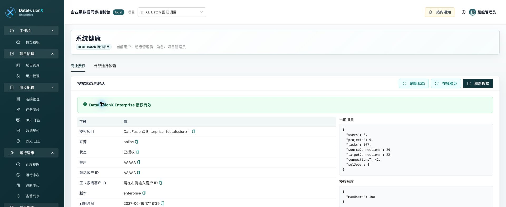
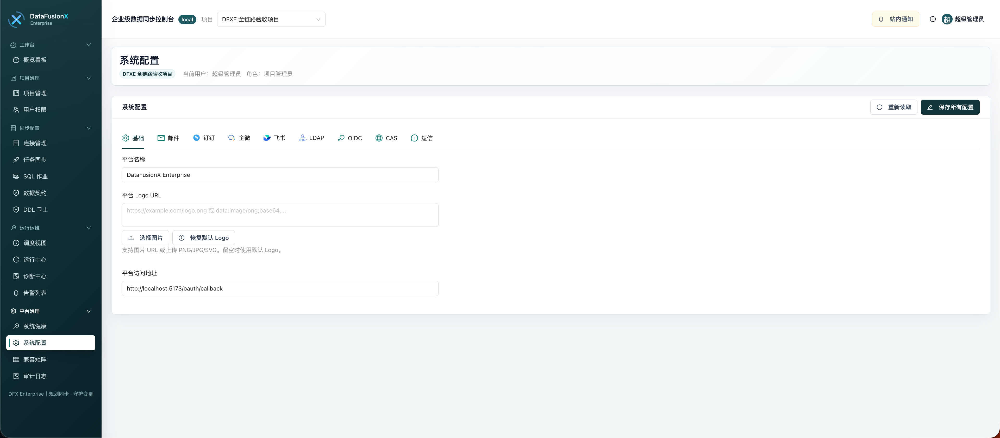
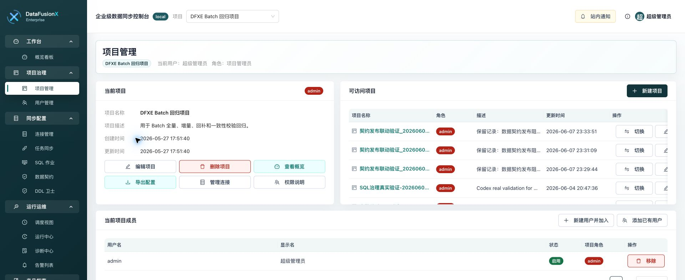
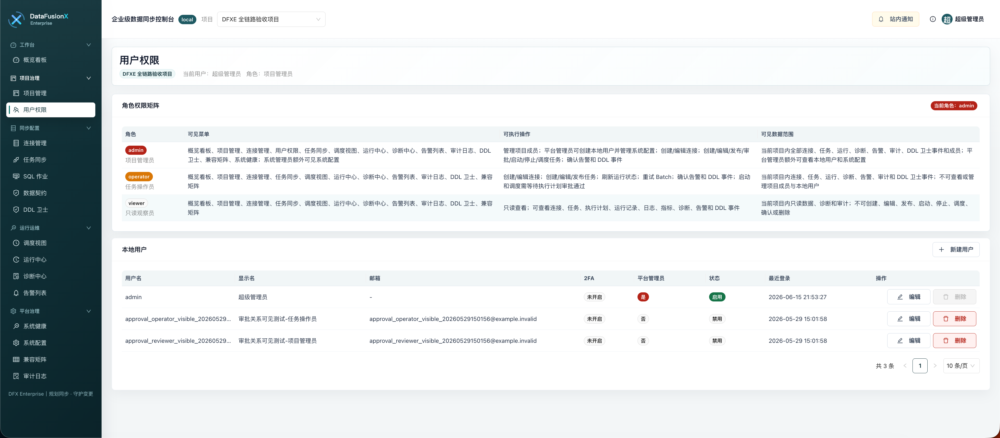
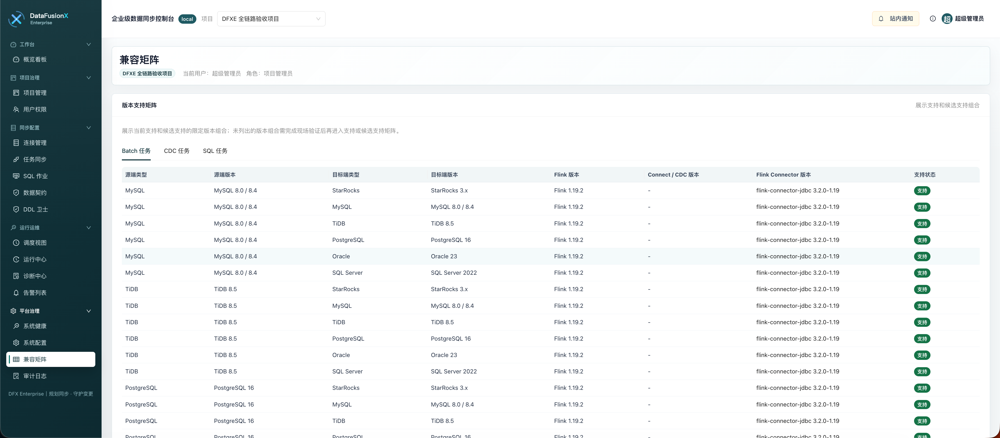
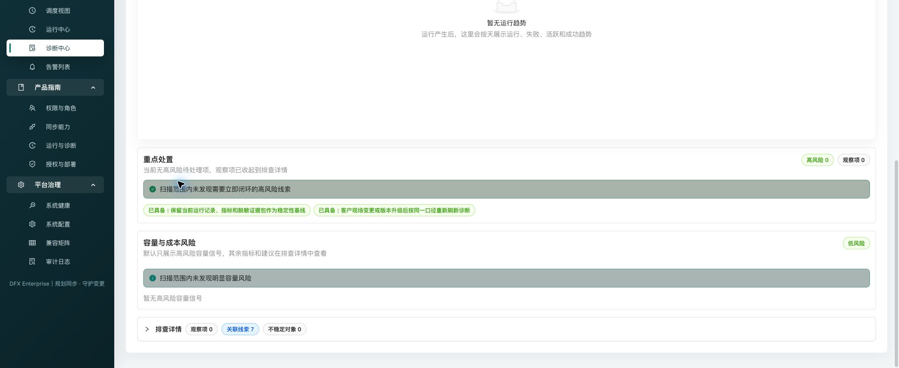
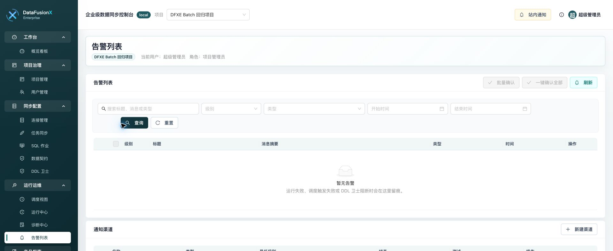
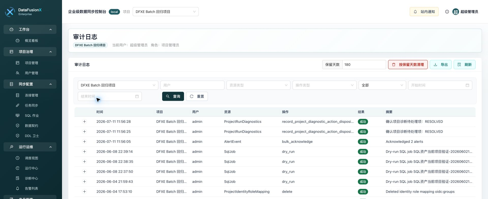
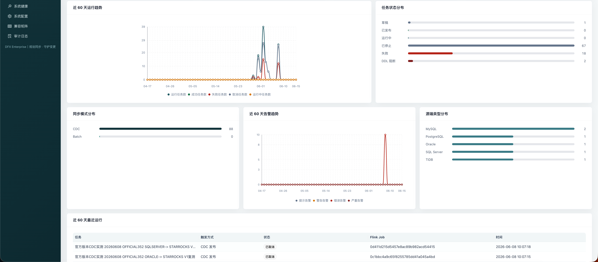

# DataFusionX Enterprise 产品使用手册

当前发布版本：`1.0.0`

本文面向完成部署后的系统管理员、项目管理员、DBA、数据开发和运维人员，按“初始化、项目、连接、任务、审批、调度、运行、诊断、投产检查”的路径说明如何把 DataFusionX Enterprise 配置到可正式使用状态。页面数据请以实际部署环境为准。

## 1. 部署完成后的初始化

部署完成后，先用 `.env` 中的初始化管理员账号登录控制台。首次登录建议立即完成以下动作：

1. 修改默认管理员密码。
2. 进入 `平台治理` → `系统健康`，确认授权、后端服务、Worker、调度器、PostgreSQL、Redis 和商业完整性状态。
3. 如需接入统一身份，进入 `平台治理` → `系统配置` 配置 LDAP、OIDC、CAS、钉钉、飞书、企业微信、邮件、短信等基础项。
4. 确认系统时间、访问域名、回调地址和通知渠道符合客户环境。

初始化阶段重点确认：

- 授权状态有效或处于试用期内。
- 当前版本、客户 ID、部署 ID 和授权额度符合本次部署目标。
- 默认管理员密码、JWT 密钥、加密密钥和数据库密码已替换为生产随机值。
- 在线授权失败或离线环境下，仍可以进入授权页面完成激活或导入。

## 2. 创建项目和成员权限

项目是 DataFusionX Enterprise 的隔离边界。连接、同步任务、SQL 作业、执行计划、运行记录、诊断、告警和审计均归属于项目。

建议流程：

1. 进入 `项目治理` → `项目管理`。
2. 创建项目，填写项目名称和同步范围说明。
3. 添加项目成员，至少配置两名项目 `admin`。
4. 为日常操作人员分配 `operator`，为只读观察人员分配 `viewer`。
5. 对关键连接、任务和 SQL 作业启用资源级授权。

角色说明：

- `viewer`：只读查看项目资源、任务、运行、诊断、告警、审计和 DDL 事件。
- `operator`：管理连接、任务和 SQL 作业，可执行启动、停止、刷新、重试等日常运维动作。
- `admin`：管理项目、成员、审批、资源授权和关键治理动作。

推荐规则：

- 系统管理员负责平台初始化和全局治理，项目管理员负责项目内审批和资源授权。
- 生产项目至少保留两名 `admin`，避免审批和应急处理单点。
- 外部身份用户自动建档后，不应自动加入项目；需要由管理员显式授权。
- 人员离职、转岗或外部身份组变化后，及时复核项目成员和资源授权。

## 3. 配置源端和目标端连接

进入 `同步配置` → `连接管理`，先配置源端连接，再配置目标端连接。

源端支持 MySQL、TiDB、PostgreSQL、Oracle 和 SQL Server。目标端支持 StarRocks、MySQL、TiDB、PostgreSQL、Oracle 和 SQL Server。

配置步骤：

1. 新建源端或目标端连接，填写类型、名称、主机、端口、库名、schema、用户名等信息。
2. 通过密文方式填写密码或凭据；保存后接口不会返回明文。
3. 点击 `测试`，确认网络、账号权限和数据库版本可访问。
4. 点击 `Schema` 或 catalog 校验入口，确认表、字段、主键、唯一约束和目标字段可读取。
5. 对生产连接配置项目级和资源级权限，避免非授权成员误操作。

注意事项：

- 编辑连接时，不填写密码表示保留原凭据。
- DataFusionX Enterprise 只做目标表只读检查，不创建、不修改、不删除生产目标表。
- 生产库授权 SQL、目标表建表、Kafka Topic、Debezium Connector、TiCDC Changefeed 和 Flink 集群需要由外部平台或 DBA 团队提前准备。

## 4. 查看兼容矩阵

进入 `平台治理` → `兼容矩阵`，确认本次源端、目标端、同步模式和外部组件版本组合是否属于支持范围。

上线前需要关注：

- Batch、CDC 和 SQL 作业分别对应不同版本组合。
- 关系型目标端 CDC 需要目标表具备兼容主键或唯一约束。
- 未列出的版本组合应先完成现场验证，再进入生产推荐矩阵。
- Flink、Debezium、TiCDC、Canal、JDBC Connector 和 StarRocks Connector 的小版本差异可能影响运行结果。

## 5. 创建 CDC 或 Batch 同步任务

进入 `同步配置` → `任务同步` 创建同步任务。任务列表会展示配置状态、最近运行、执行计划版本、审批状态和调度状态。

### 5.1 CDC 同步

CDC 同步消费客户外部已创建的 Kafka Topic，经外部 Flink SQL Gateway 提交作业写入目标端。创建 CDC 作业前请确认：

- Kafka Topic 已存在，消息格式符合兼容矩阵。
- Debezium、Canal 或 TiCDC 的版本组合已经过验证。
- 目标表已存在。
- 关系型目标端具备兼容主键或唯一约束。
- 字段映射覆盖目标端主键或唯一约束。
- 不存在同 JDBC endpoint、同库、同 schema、同表的自循环风险。
- DDL 卫士策略符合现场要求。

### 5.2 Batch 同步

Batch 同步适合全量、增量、回灌和切片批处理。系统支持从多张源表批量生成多个单表任务草稿，但仍保持一表一任务、一表一执行计划、一表一运行观测。

Batch 作业发布前请确认：

- 源端和目标端 catalog 均可读取。
- 增量字段、主键、切片字段和过滤条件符合业务口径。
- 目标端已有表结构，字段类型兼容风险已确认。
- 一致性校验策略已配置，包括条数校验、主键抽样比对和关键字段 checksum。

校验失败只产生告警和审计，不自动修改目标端数据。

## 6. 创建 SQL 作业

进入 `同步配置` → `SQL 作业` 创建轻量 SQL 作业。

SQL 作业只提交到外部 Flink SQL Gateway，不直接 JDBC 连接生产库执行 SQL。

支持能力：

- `SINGLE_SQL` 单 SQL 作业。
- `SEQUENTIAL_BATCH` 多步骤串行跑批。
- 参数定义、默认值、枚举、数值范围和字符串正则约束。
- 输入资产和输出资产声明。
- 发布审批、调度、停止、刷新、失败续跑和结果预览。

推荐流程：

1. 声明输入资产和输出资产。
2. 将日期、租户、分区等运行变量定义成参数。
3. 使用预览和发布前校验确认最终 SQL。
4. 发布不可变版本并由项目 `admin` 审批。
5. 审批后再手动运行或配置调度。

默认阻断生产表级 `DROP`、`ALTER`、`TRUNCATE`、`DELETE`、`UPDATE`、`MERGE`、`GRANT`、`REVOKE` 等高危语句。

## 7. 发布执行计划和审批

CDC、Batch 和 SQL 作业都应先发布执行计划，再由项目 `admin` 审批。审批通过前不得启动、部署或启用调度。

审批时重点检查：

- 源端、目标端、表名、字段映射、主键或唯一约束。
- Flink SQL Gateway、Kafka、Topic、Connector 版本和目标表准备情况。
- SQL 作业最终 SQL、参数冻结、输入输出资产和高危语句检查结果。
- DDL 卫士策略和一致性校验策略。
- 本次发布是否需要变更窗口、回滚方案和通知负责人。

审批、驳回、发布、启动、停止、重试、删除和 DDL 处理等关键动作都会进入审计日志。

## 8. 配置调度视图

进入 `运行运维` → `调度视图` 管理一次性运行、业务日期补跑、指定时间运行和 Cron 调度。

常用操作：

- 启动已审批的 CDC / Batch 任务。
- 对 SQL 作业发起业务日期补跑。
- 配置指定时间运行或 Cron 周期运行。
- 停止、刷新或失败续跑运行实例。
- 查看计划执行时间和实际执行状态。

生产环境变更调度前，应确认当前运行中心没有同任务的冲突实例；多节点部署中只能保留一个调度节点运行 `celery-beat`。

## 9. 查看运行中心

进入 `运行运维` → `运行中心` 查看 CDC、Batch 和 SQL 作业运行记录。

排查运行问题时建议按以下顺序：

1. 查看运行状态、触发方式、开始时间、结束时间和失败分类。
2. 查看 Flink Job ID、Flink Job 状态、Kafka lag、端到端事件延迟和 Flink Slot 容量。
3. 查看运行日志、步骤日志、最终 SQL 和结果预览。
4. 查看告警、DDL 阻断和一致性校验结果。
5. 必要时进入单运行诊断页，补充根因、处理结论、下一步和证据。

运行状态流转应保持可审计、可恢复、可解释；外部运行时错误不会被静默吞掉。

## 10. 处理 DDL 卫士事件

进入 `同步配置` → `DDL 卫士` 查看 CDC DDL 事件和 Batch catalog drift 阻断。

典型处理流程：

1. 查看阻断事件的来源任务、表名、DDL 类型、字段变化和风险说明。
2. 与 DBA 或业务负责人确认变更是否符合预期。
3. 若变更需要同步链路适配，先调整目标表、字段映射或任务配置。
4. 处理完成后确认或关闭阻断事件。
5. 在审计日志中保留确认人、处理结论和时间。

标准 CDC 启用 DDL 卫士时建议使用独立 DDL Topic；TiCDC TSO 严格模式可按当前实现复用业务 Topic。

## 11. 查看诊断中心

进入 `运行运维` → `诊断中心` 聚合查看运行失败分层、稳定性趋势、不稳定对象、容量风险和待闭环动作。

适合用于：

- 每日巡检项目风险。
- 识别失败率高的任务、连接、目标端或 Flink 集群。
- 查看待闭环动作和证据包。
- 判断 Kafka lag、事件延迟或 Flink Slot 容量是否需要扩容或调度调整。
- 形成问题处置记录，便于交接和审计。

诊断中心默认读取最近快照；需要重新聚合时可显式刷新。

## 12. 配置告警和通知

进入 `运行运维` → `告警列表` 查看告警，进入系统配置中维护企业微信、飞书、Slack、邮件、通用 Webhook 和 Alertmanager 渠道。

建议至少配置：

- 生产任务失败告警。
- DDL 阻断告警。
- Kafka lag 或端到端延迟告警。
- Flink Slot 容量风险告警。
- 授权、系统健康和调度异常告警。

Webhook URL、签名密钥和邮件配置中的敏感字段会加密保存并脱敏展示。

## 13. 审计日志和配置迁移

进入 `平台治理` → `审计日志` 查看关键操作记录。

审计覆盖发布执行计划、审批、部署作业、调度启停、运行重试、DDL 卫士确认、审计清理和配置导入导出等关键动作。审计日志支持脱敏 CSV 导出和按保留天数清理。

配置导出不包含密码；导入到新环境时必须显式提供目标环境连接密码，导入任务默认保持草稿状态。

## 14. 概览看板和日常巡检

进入 `工作台` → `概览看板`，按项目查看近 30 天或近 60 天运行状态。

值班巡检建议关注：

- 近期运行成功率、失败运行、未确认告警和 DDL 阻断。
- Flink Slot 使用、Kafka lag 和端到端事件延迟。
- 任务状态分布、同步模式分布和源端类型分布。
- 最近运行记录和未闭环风险。

## 15. 投产检查清单

首批任务投产前，请确认：

- 管理员默认密码已修改。
- 授权状态有效或仍处于试用期内，功能和额度满足当前项目。
- 项目成员和资源级授权已配置。
- 源端、目标端、Flink SQL Gateway、Kafka、Topic、Connector 和目标表均已由外部平台准备。
- 连接连通性检查和 catalog 校验通过。
- 执行计划已发布并审批。
- DDL 卫士策略、告警通知和审计保留策略已配置。
- 至少完成一次手动验证运行，并在运行中心确认日志、指标和校验结果。
- 诊断中心没有未处理的高风险项。
- 升级前备份、回滚脚本、日常巡检负责人和告警接收人已确认。

## 16. 安全边界

DataFusionX Enterprise 只做控制面。以下资源必须由客户外部准备和治理：

- Kafka Topic。
- Debezium Connector。
- TiCDC Changefeed。
- Flink 集群和 Flink SQL Gateway。
- StarRocks 或关系型目标表。
- 数据库授权 SQL。
- 生产数据面资源容量和运维。

不要在工单、截图、日志或排查包中暴露 `.env`、授权文件、激活码、Token、私钥、部署指纹、数据库连接串或生产拓扑。
